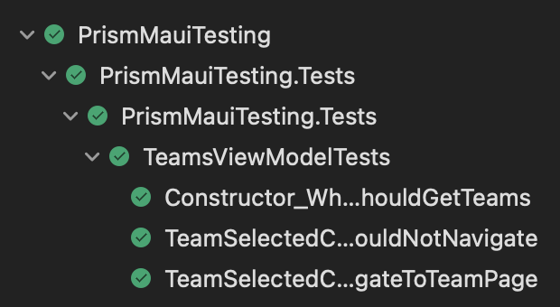

# PrismMauiTesting

Sample app playing around with Prism Maui &amp; unit testing capabilities

The aim of this repo is to understand the differences in design of unit tests when using prism in maui vs when we used prism in xamarin forms.

## Sample

This is a really basic navigation demo with a list of [LEC teams](https://twitter.com/LEC) that you can click on to reveal more details about the team. Please ignore the atrocious UI, this is not a design demonstration app!

## Tests

I managed to get the tests working with a custom mock implementation of the `INavigationService` with some extra methods, I think I can turn this into some kind of testing library to make things alot easier!

~~Currently the navigation service mock tests do not work, I need to work out how to mock prisms `INavigationService` now that the majority of the methods are extension methods.~~

